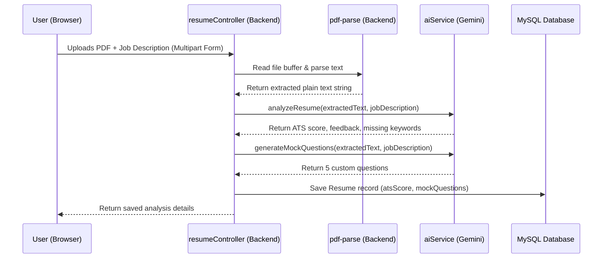

# 🎓 Resume Architect - Interview & Architecture Study Guide

Welcome to the comprehensive architecture guide for **Resume Architect**. This document is designed to help you thoroughly understand every line of code, design pattern, and feature implementation in your project so that you can explain it with absolute confidence in technical interviews.

---

## 📌 Table of Contents
1. **System Architecture & Folder Structure**
2. **Database Models & Relationships (Sequelize + MySQL)**
3. **Core Feature 1: Resume Upload & ATS Parsing**
4. **Core Feature 2: Voice-Enabled Mock Interview**
5. **Core Feature 3: Grading & Assessment Engine**
6. **Critical Bug Fixes & Technical Decisions Explained**
7. **Key Interview Questions & Answers About This Project**

---

## 1. 🏗️ System Architecture & Folder Structure

This application is built as a **decoupled monorepo** containing two main folders:
1.  `frontend/`: A modern Single Page Application (SPA) built using **React** and bundled using **Vite**.
2.  `backend/`: A RESTful web service API built using **Node.js**, **Express.js**, and **Sequelize ORM** talking to a **MySQL** database.

### Folder Layout Breakdown:
```text
resumearchitect/
├── backend/
│   ├── create-db.js             # Utility to bootstrap/create the MySQL database
│   ├── server.js                # Server entrypoint (initializes Express, connects DB)
│   ├── package.json             # Node.js backend dependencies
│   └── src/
│       ├── config/
│       │   └── database.js      # Sequelize instance configuration
│       ├── models/
│       │   ├── User.js          # User database model
│       │   ├── Resume.js        # Resume analysis database model
│       │   └── Interview.js     # Mock Interview session database model
│       ├── controllers/
│       │   ├── authController.js       # Register/Login request handlers
│       │   ├── resumeController.js     # Resume upload, parsing & retrieval
│       │   └── interviewController.js  # Interview session start, reply & grade
│       ├── routes/
│       │   └── [auth, resume, admin, interview].js  # HTTP endpoint route mapping
│       ├── middleware/
│       │   └── authMiddleware.js       # JWT validation middleware
│       └── services/
│           └── aiService.js     # Core AI (Gemini) API integrations & fallback algorithms
│
└── frontend/
    ├── index.html               # SPA entrypoint HTML wrapper
    ├── src/
    │   ├── main.jsx             # React entrypoint (attaches app to DOM)
    │   ├── App.jsx              # Main React router configuration
    │   ├── index.css            # Custom CSS system (dark mode, glassmorphism UI)
    │   ├── components/
    │   │   └── Navbar.jsx       # Persistent navigation component
    │   └── pages/
    │       ├── Home.jsx         # Landing page UI
    │       ├── Register/Login   # Authentication pages
    │       ├── Dashboard.jsx    # Resume uploading, ATS score and custom questions dashboard
    │       └── MockInterview.jsx# Webcam & Voice interview UI
```

---

## 2. 🗄️ Database Models & Relationships

We use **Sequelize ORM** to manage a MySQL database. There are 3 principal tables:

### 1. `User` (Users Table)
- **Fields**: `id` (Primary Key), `name`, `email` (Unique), `password` (bcrypt-hashed string), `role` (default: 'user' / 'admin').
- **Purpose**: Authenticates users and groups data.

### 2. `Resume` (Resumes & ATS Scores Table)
- **Fields**:
  - `id` (Primary Key)
  - `fileName` (Original file name string)
  - `extractedText` (LONGTEXT - raw text scraped from the parsed PDF)
  - `atsScore` (JSON - contains calculated score, evaluation feedback, and missing keywords list)
  - `mockQuestions` (JSON - list of 5 specific interview questions generated for this resume)
- **Relationships**: A `User` has many `Resumes`. A `Resume` belongs to a `User` (`userId` ForeignKey).

### 3. `Interview` (Mock Interview Sessions Table)
- **Fields**:
  - `id` (Primary Key)
  - `transcript` (JSON - array of message history: `[{role: 'ai', text: '...'}, {role: 'user', text: '...'}]`)
  - `score` (Overall evaluation score, 0 to 100)
  - `feedback` (Detailed markdown text evaluating performance)
- **Relationships**:
  - A `User` has many `Interviews` (`userId` ForeignKey).
  - A `Resume` has many `Interviews` (`resumeId` ForeignKey).

---

## 3. 📄 Core Feature 1: Resume Upload & ATS Parsing

### How the Upload Flow Works:


### Key Technical Details:
1.  **File Interception (Multer)**: In `backend/src/routes/resume.js`, we use `multer` middleware to intercept incoming file uploads, saving them temporarily inside the `backend/uploads/` directory.
2.  **PDF Scraping (`pdf-parse`)**: We read the uploaded file buffer into `pdf-parse`, which extracts all raw text strings from the document.
3.  **ATS Evaluation (`aiService.js`)**:
    - **Gemini Model Call**: Sends the resume text and the job description to `gemini-2.5-flash` with a JSON output configuration (`responseMimeType: "application/json"`).
    - **Algorithmic Fallback (`localAnalyzeResume`)**: If the Gemini API limits are reached, the system falls back to a **Vector Space Model (VSM)**. It computes word frequency vectors (Term Frequency) for both the resume and the job description, calculates **Cosine Similarity**, checks contact detail structures, computes tech keyword inclusion ratios, and scores the resume out of 97 points.

---

## 4. 🎙️ Core Feature 2: Voice-Enabled Mock Interview

### How the Interview Stream Works:
- **Camera & Video Feed**: The frontend uses `react-webcam` to display a live camera feed of the user. To respect user privacy, the video stream is kept local to the browser and is not uploaded to the server.
- **Continuous Speech Recognition**: We interface with the browser's Web Speech API (`webkitSpeechRecognition` in Chrome/Edge).
  - To prevent the transcription from cutting off or resetting when the candidate pauses to think, we configure `recognition.continuous = true` and `recognition.interimResults = true`.
  - In the `onresult` listener, we loop from `0` to `event.results.length` on every event, concatenating all completed (`isFinal`) segments and temporary (`interim`) segments. This ensures that the transcript is continuously appended without being overwritten.
  - The `onstart`, `onend`, and `onerror` hooks are bound to control the recording indicator in the UI automatically.

---

## 5. 📊 Core Feature 3: Grading & Assessment Engine

Once the candidate clicks **"End Interview & Grade"**, the backend evaluates the transcript.

### 1. Weighted Rubric (Gemini Prompt)
The AI analyzes the candidate's answers against a professional hiring rubric:
-   **Technical Depth & Accuracy (40% weight)**: How precise and accurate were their explanations?
-   **Communication & Structure (20% weight)**: Did they use structured behavioral framing (like the **STAR method**)?
-   **Problem Solving & Abstraction (20% weight)**: Did they outline design decisions and trade-offs?
-   **Resume Alignment (20% weight)**: Did they successfully tie their answers to actual experiences on their resume?

### 2. High-Accuracy Fallback Grader (`localGradeInterview`)
If the Gemini API is offline or has run out of request quota, the local grader evaluates the transcript:
1.  **Keyword Scraper**: Checks if the candidate's answers contains tech terms listed in their resume.
2.  **Depth Analyzer**: Searches for critical software engineering verbs/nouns (e.g., *design, architecture, optimization, latency, caching, database indexes, trade-off*).
3.  **Structure Scraper**: Looks for flow indicators (*first, then, because, finally, however, for example*).
4.  **Length Analysis**: Measures average word count per answer (favouring 40–80 words for detailed articulation).
5.  **Score Compilation**: Assigns weighted scores to each rubric section, generating a professional, multi-section report in Markdown.

---

## 6. 🛠️ Critical Bug Fixes & Technical Decisions Explained

### Bug 1: Speech Recognition Overwriting Transcripts
- **The Bug**: The `onresult` handler looped starting from `event.resultIndex` to the end, then wrote that value to state:
  `for (let i = event.resultIndex; i < event.results.length; i++)`
  Whenever the user paused, a new index was started, meaning the old index values (0 to `resultIndex - 1`) were thrown away, overwriting the textbox.
- **The Fix**: Changed the loop to start from `0`. Because `event.results` maintains a historical record of all segments during the current session, starting the loop from `0` reconstructs the entire speech history since the mic was toggled on.

### Bug 2: Missing Interview Transcripts (Sequelize JSON Save Issue)
- **The Bug**: In Node/Sequelize, when you push values directly into a JSON column array and save the instance:
  ```javascript
  let transcript = interview.transcript;
  transcript.push(newMessage);
  interview.transcript = transcript;
  await interview.save();
  ```
  Sequelize checks if the *reference pointer* of `interview.transcript` has changed. Since it was updated in-place, the reference is identical. Sequelize thinks the field hasn't changed and skips updating the DB. This led to empty transcripts during grading.
- **The Fix**: We cloned the array to change the reference, and explicitly marked the JSON column as updated:
  ```javascript
  interview.transcript = [...transcript];
  interview.changed('transcript', true);
  await interview.save();
  ```

### Bug 3: Missing Mock Questions on ATS Score Page & Legacy Support
- **The Bug**: The dashboard template mapped `mockQuestions` list, but they were never generated or saved during upload.
- **The Fix**: Built a question generator (`generateMockQuestions` + a local tech-keyword custom questions fallback). We integrated it with `uploadAndAnalyze` and also retrofitted the `getUserResumes` controller. When loading the dashboard, if a legacy resume is detected without questions, it generates and saves them dynamically on the fly.

---

## 7. 💬 Key Interview Questions & Answers

### Q1: How did you implement real-time Speech-to-Text on the frontend?
**Answer**: "I used the Web Speech API (specifically `webkitSpeechRecognition`). I set `continuous` and `interimResults` to true. To ensure that natural pauses didn't overwrite the textbox, I mapped the `onresult` listener to iterate from index `0` of `event.results` and collect both final and interim transcripts on every update. I also bound lifecycle hooks (`onstart`, `onend`, `onerror`) to synchronize the recording indicator in the React UI."

### Q2: What happens if your AI Service (Gemini API) fails or runs out of free requests?
**Answer**: "I built robust local fallback systems for every AI capability. For resume analysis, we fall back to a Vector Space Model (VSM) using Cosine Similarity on Term Frequency matrices. For grading, we run an algorithmic transcript parser that evaluates keyword-matching density, technical vocabulary (like 'scale', 'cache', 'trade-off'), response word length, and transition words to calculate a weighted rubric score out of 100 and write a detailed markdown report."

### Q3: Why did you use Sequelize JSON columns, and what is the challenge with saving updates on them?
**Answer**: "I used Sequelize JSON columns to store arrays of message objects (transcripts) because they are highly flexible for chat histories. The challenge is Sequelize's dirty-checking tracker: modifying a JSON object in-place doesn't alter its reference pointer, so `instance.save()` won't detect changes. To fix this, I cloned the array to assign a new reference and explicitly called `instance.changed('fieldName', true)` to force Sequelize to issue the database UPDATE query."
